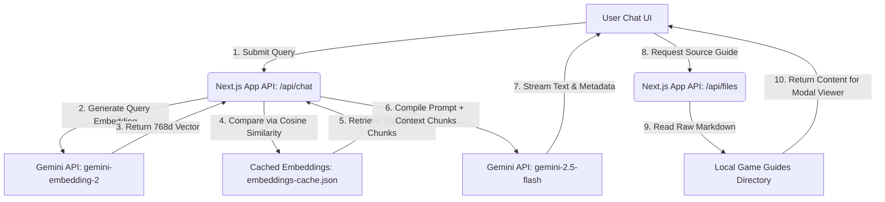

# 🔍 Game AI RAG Explorer

<div align="center">

[](https://nextjs.org)
[](https://react.dev)
[](https://ai.google.dev)
[](https://typescriptlang.org)

<p align="center">
  A premium, state-of-the-art Web application demonstrating Retrieval-Augmented Generation (RAG) powered by Google's Gemini API and Next.js. Chat with local game guide markdown databases using semantic search, configure similarity filters dynamically, and inspect retrieved contexts in real-time.
</p>

[✨ Key Features](#-key-features) • [🚀 Getting Started](#-getting-started) • [⚙️ Architecture](#-system-architecture) • [🧪 Testing / CLI](#-testing--cli)

</div>

---

> [!NOTE]
> **Gemini RAG System & Philosophy**: Game AI RAG Explorer integrates modern Semantic Search with Large Language Models. It parses and chunks raw game guides, generates embeddings via the `gemini-embedding-2` model, caches the vectors locally in `embeddings-cache.json` to optimize performance, and utilizes dot-product cosine similarity to fetch relevant contexts for the `gemini-2.5-flash` model.

---

## ✨ Key Features

*   **🔍 Local Markdown Game Database**: Built-in strategy and lore guides for *Elden Ring*, *Hollow Knight*, *Cyberpunk 2077*, and *Expedition 33*.
*   **🤖 Gemini AI Integration**: Seamless connection to the official `@google/genai` SDK using `gemini-embedding-2` for query embeddings and `gemini-2.5-flash` for streaming response generation.
*   **⚡ Local Vector Embeddings Cache**: Automatically chunks documents by Markdown headings and caches 768-dimension vector embeddings locally to prevent redundant API cost and latency.
*   **🎛️ Real-time Similarity Inspector**: A dedicated UI side panel highlighting the retrieved markdown chunks, their source filenames, sections, contents, and similarity scores.
*   **🎚️ Dynamic Similarity Threshold**: Adjust the search sensitivity threshold (e.g., 0.3 - 0.6) on-the-fly to filter out less-relevant documentation chunks.
*   **📄 Integrated Markdown Document Viewer**: Read the full original guides directly inside a responsive overlay dialog within the UI.

---

## ⚙️ System Architecture

The following diagram illustrates how the Next.js frontend, API endpoints, cached local vector storage, and the Gemini API communicate:



---

## 🛠️ Technology Stack

| Technology | Version | Purpose |
| :--- | :--- | :--- |
| **Next.js** | `16.2.9` | React framework with App Router & API routes |
| **React** | `19.2.4` | UI component layer |
| **@google/genai** | `^2.10.0` | Google GenAI official SDK |
| **Marked** | `^18.0.5` | Fast markdown parser for client-side chat bubble & viewer rendering |
| **Lucide React** | `^1.22.0` | Sleek modern icons |
| **TypeScript** | `^5` | Strict static typing and code reliability |
| **CSS Modules** | Standard | Component-scoped, responsive UI styling |

---

## ⚡ RAG Logic Highlight

The RAG pipeline calculates the similarity between the query embedding and the indexed guide chunks using dot-product Cosine Similarity:

```typescript
// From src/lib/rag/retriever.ts
export function calculateCosineSimilarity(vecA: number[], vecB: number[]): number {
  if (vecA.length !== vecB.length) {
    throw new Error(`Vector lengths do not match: ${vecA.length} vs ${vecB.length}`);
  }
  
  let dotProduct = 0;
  let normA = 0;
  let normB = 0;
  
  for (let i = 0; i < vecA.length; i++) {
    dotProduct += vecA[i] * vecB[i];
    normA += vecA[i] * vecA[i];
    normB += vecB[i] * vecB[i];
  }
  
  if (normA === 0 || normB === 0) {
    return 0;
  }
  
  return dotProduct / (Math.sqrt(normA) * Math.sqrt(normB));
}
```

---

## 🚀 Getting Started

### 1. Prerequisites

Ensure you have **Node.js** (v18+) and **npm** installed on your system.

### 2. Installation

Clone this repository and install the project dependencies:

```bash
git clone https://github.com/LuisMoralesMx/game-ai-rag.git
cd game-ai-rag
npm install
```

### 3. API Configuration

To enable Gemini AI capabilities, you must configure your API key:

1. Create a `.env.local` file in the root directory:
   ```bash
   # On Windows (PowerShell):
   New-Item -Path .env.local -ItemType File
   ```
2. Open `.env.local` and add your Google Gemini API Key:
   ```env
   GEMINI_API_KEY=your_gemini_api_key_here
   ```
   *You can obtain a key for free/pay-as-you-go from [Google AI Studio](https://aistudio.google.com).*

### 4. Running the Development Server

Start the local server:

```bash
npm run dev
```

Once running, open [http://localhost:3000](http://localhost:3000) in your browser. On the first user request, the application automatically processes the guide files in `src/data/games`, generates their embeddings, and writes the cache to `src/data/embeddings-cache.json`.

---

## 🧪 Testing & CLI

### Running the Retrieval CLI Test

You can test the semantic search and vector cache retrieval pipeline directly via the command line. This script forces a cache regeneration, queries Hollow Knight and Expedition 33 data, and displays matches alongside their similarity scores:

```bash
# Run the test script using tsx / ts-node
npx tsx src/scripts/test-retrieval.ts
```

---

## 📦 Building

To compile the application for production deployment:

```bash
npm run build
```

This command optimizes the build bundles and compiles TypeScript files into the `.next` production distribution.
